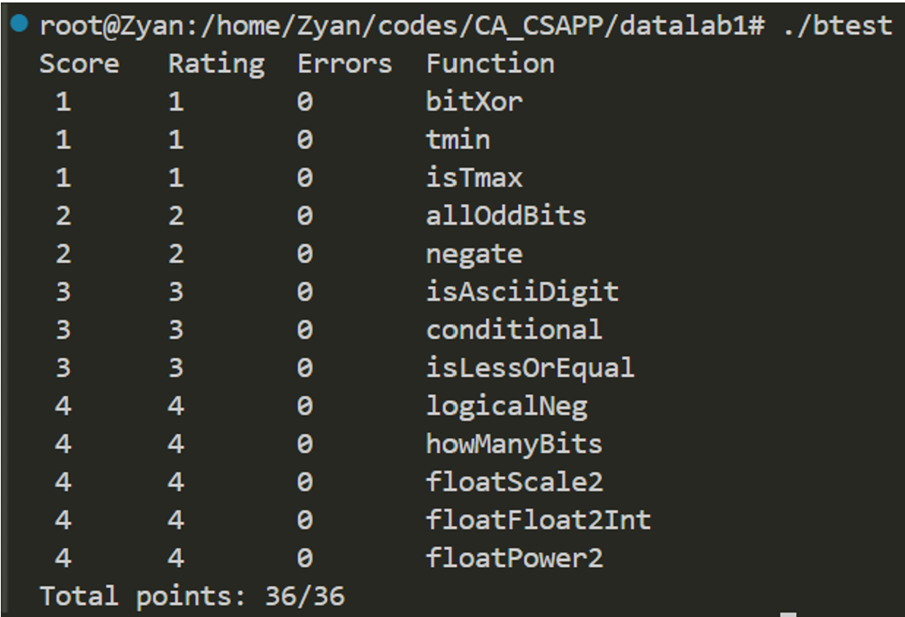

# **CSAPP lab1 Datalab**

#### **整数部分**：

1、 **bitXor**：先用 `x & y` 取出两者都为1的位，然后用 `~x & ~y`) 取出两者都为0的位，`~( x & y)` 中1代表 x, y不同的位或者都为0的位，`~(~x & ~y)` 中1代表 x, y不同的位或者都为1的位，两者取 & 后1就是 x, y 有不同的位。

2、 **tmin**：补码最高位为负数，将1左移31位即可获得最小值 -2^31。

3、 **isTmax**：max是 `0x7FFFFFFF`, 由于不能直接左移，只能从其性质特点出发。`0x7FFFFFFF + 0x7FFFFFFF = 0xFFFFFFFE,` 相当于左移了一位，加一就变成 `0xFFFFFFFF`，取~再！即满足条件。但有这个性质的还有0xFFFFFFFF自身，所以加上!!(x^X) 进行排除。

4、 **allOddBits**：这题可以用掩码过滤掉偶数位的信息，只保留奇数位。`0xAAAAAAAA` 作为掩码与 x 取&，然后和`0xAAAAAAAA` 取异或比较，最后取反即为答案。

5、 **negate**：补码格式下，对应的负数补码即为原补码取反加一

6、 **isAsciiDigit** : 判断`0x30 <= x <= 0x39`是否满足，让x加上 `0x30` 的相反数和 `0x39` 加上x的相反数 `(-a = ~a+1)`，然后右移31位根据符号位判断即可，然后两部分取非再取&即为答案。

7、 **conditional**：先将x标准化，`0->0`, `!0->1` ，然后用掩码 `~0+x` 和 `~(~0+x)` 分别取 `&`，然后两者之间取或即为答案。

8、 **isLessOrEqual**：先将 x 和 y 右移31位后取异或判断符号是否相同，然后用 `y+~(x)+1` 获得 `y-x` 的值。分两种情况讨论，若符号相同，则将差右移31位根据符号判断；若符号不同，则根据x的符号判断。两个情况间取或。

9、 **logicalNeg**：除了0，非零数和其相反数的补码最高位一定是不同的，两者进行或运算，最高位一定是1，右移31位成 `0xFFFFFFFF`，加一变成0。0的补码+1为1。

10、    **howManyBits**：这题我觉得是比较烦的一题。先取得符号然后算数右移31位形成掩码，然后和 x 取&将负数转为正数（先不考虑符号位，同时为了防止向上借位，不+1）。为了减少操作数，我采用了二分法，先右移16位查看是否有17位，保存到标志h16，如果有，x就右移16位，只剩下高位，下一步是判断是否有9位，5位，3位，2位最后返回每个标志对应的位数和，再加上剩下的 x (0或1) 和一位符号位即为答案。

#### **浮点数部分：**

11、    **floatScale2**：根据IEEE规则用掩码将frac，exp取出来，sign用x右移31位获得。乘以2的操作分三类情况考虑：若exp是 0x7f800000，则是NaN或者无穷，直接返回x；若是全零，则将frac右移一位即可；其他情况为规格化，直接让exp+1 (0x800000) 即可。最后用或运算将sign，exp，frac拼起来并返回即可。

12、    **floatFloat2Int**：先用掩码将frac取出，然后右移23位再取exp，最后右移31取sign。确定uf表达的数是在int的范围内，如果 `exp-127>30` 就返回 `0x80000000u`；`exp-127<0` 就返回 0。其他情况符合条件，将`frac>>23+1` 变成标准的 `1.XXX`，然后左移阶数 `exp-127`。如果 `sign>0`，就返回 `~a+1`; `sign<0` 就直接返回 a。

13、    **floatPower2**：如果 `x<-127`，则阶数编码超出单精度浮点数能表示的最小值，返回0；如果 `x>=128`，则exp已经为全1，是 `+INF`，返回 `0x7f800000`；其他情况返回 `(x+123)<<23` 即为 2^x。

#### **验证截图：**

 

 
