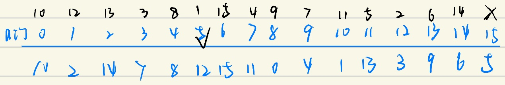

# CSAPP lab2 Bomblab

* 本实验具体实现内容可能有所差异，但是方法通用

### **Phase_1**：

先把 `%rsp` 减去8，然后将 `%rsi` 指向 `v0xcd ..1b5a(%rip)`，读取之后发现是字符串 “I can see Russia from my house!”，随后调了 `strings_not_equal` 函数，从名称和汇编来看，是检查两地址下的字符串是否相等，通过返回值来判断，不相等就爆炸。由此看来答案是 “I can see Russia from my house!”。

### **Phase_2**：

汇编开头先是栈操作，然后将 `%fs:0x28` 赋给了 `%rax`，用 `gdb x/s` 查看，发现是我自己随便输入的字符串，后将输入存在内存地址 `(%rsp+0x18)`，将 `%eax` 置0，又将栈指针赋给 `%rsi`，随后调用了 `read_six_numbers` 函数，从名称来看应该是有六个数。`%rsi` 应该是要存放的是我的输入，后面几行将我的输入的后个位分别赋给了 `%rcx`, `%rax` , `%r8` , `%r9`，在调标准库的 `scanf` 函数，将 `%eax` 置0，斌给 `%rsi` 重新赋地址了，用 `x/s` 查看后显示为 "%d %d %d %d %d %d"。在这行后，用”si”向后退推进中，gdb给出了 “%d %d %d %d %d %d” 的提示，坐实是输入六个数。`Scanf` 返回后，`%eax` 与 `0x5` 做了比较，如果小于或等于直接爆炸。返回 Phase_2 后，将 `%rsp`（也就是输入的第一个数）和零相比，如果是负数就跳转爆炸，否则就将 `%rsp` 的值赋给 `%rbp`，把 `%ebx` 赋为1，然后跳转，使 `%eax` 与 `%ebx` 值相等，然后加上此时 `%rbp` 中的数，并和 `%rbp+0x4` (也就是输入的下一个数) 进行比较，如果相等就进入下一次循环，此时 `%eax` 中的数比 `%rbp` 中的数大1。在循环中，`%ebx` 充当计数器，使得两个数之间的差值每向后推一个数就增加1，最终当`%ebx`等于6时退出循环，也就是函数结束。由此可以推断，答案第一个数是一个非负数，然后后五个数的**差值满足1，2，3，4，5** 即可，如 “0 1 3 6 10 15” 就是一组答案。

### **Phase_3**：

前几行的操作和上一题很像，输入的东西先被赋给 `%rax` 然后再赋给`(%rsp+0x8)`，`%rdx` 也指向 `%rsp` 指的地址。将 `0x1c6b(%rip)` 内容赋给了 `%rsi`，用 `x/s` 可以读出为" %d %d %d %d"，说明答案是四个数。然后调用了标准库的 `scanf` 函数，回来后将 `%eax` 的值与1比较，如果小于或等于就跳转爆炸，否则比较 `(%rsp)` 与7的值，如果 `(%rsp)`（这里 `x/s` 读出发现是我输入的第一个数）大于7就爆炸（且是无符号数），否则把 `(%rsp)` 地址上的值赋给 `%eax`，并把 `%rdx` 指向 `0x1ae2(%rip)`。如果第一个数输入为1，择一系列操作后 `%rax` 的值就是-72，然后就 `notrack jmp *%rax`，这里看来是一个switch结构。跳转后，将我的第二个数字和 `0xa9(169)`比较，若不相等就爆炸，由此可见1后面应该跟169。再往后一系列是栈操作，然后 `ret` 返回 `main` 函数，问题结束。由于是 `switch` 结构，应该根据第一个数输入的不同，答案不唯一，其中一个答案是“1 169 x y”，x y是任意整数。

### Phase_4：

前几行的栈操作很熟悉了，直接到把 `%rsi` 指向 `0x1b7a(%rip)`，用 `x/s`读出为 "%d %d"，说明是输入两个数。然后是 `scanf` 函数，回来后将 `%eax` 与2进行比较，不同就爆炸，否则将 `(%rsp)`（输入的第一个数）与 `0xe`(14) 比较（从jbe可以得出输入的数时无符号数），如果大于就爆炸，否则将 `%edx` 赋为 `0xe`(14)，`%esi` 赋为0，并把 `%edi` 指向 `(%rsp)` ，随后调了 `func4` 函数。在阅读 `func4` 前，phase_4收到返回值后与 `0x7` 进行比较，不相等就爆炸，说明 `func4` 的结果要是7。我按照func4把我随便输的第一个数带入算了一遍，发现结果并不是7。`func4` 运用了递归，一个输入对应一个输出，且第一个数在0~14之间。反向推导难度有点大（虽然后面呢也用了一点），于是我把 `func4` 还原成了c语言，然后从0-14一个一个试过去，发现第一个数是7的时候满足条件，所以答案就是 “7 7”。

下面是 `func4`:

```c
#include <stdio.h>

int func4(int a, int b, int c){//a=%rdi即为输入的第一个数 b=%rsi c=%rdx
    int ret_v = c-b; //%eax
    int t = ((unsigned)ret_v)>>31;// %ebx
    t += ret_v;
    t=t>>1;
    t+=b;
    if(t>a){
        c=t-1;
        int r = func4(a,b,c);
        return 2*r;
    }
    else if (t<a){
        b=t+1;
        int r =func4(a,b,c);
        return 2*r;
    }
    else{
        return t;
    }
}

int main(){
    int a;
    scanf("%d",&a);
    printf("%d\n",func4(a,0,14));
}
```


### **Phase_5:** 

前面几步是栈操作，读取 `(%rip+0x1b01)` 显示为 ”%d % d”,说明答案是 2 个数。`Scanf` 回来发现把我输入的第一个数 `(%rsp)` 和 `0xf` 取 `and` 也就是只保留低四位，然后和15做比较，如果相等就爆炸，否者把 `%ecx` 和 `%edx` 赋为0，然后把 `%rsi` 移到了 `0x1989(%rip)`，`x/d` 读出来是个数。然后后面几行是一个循环，`%edx` 是计数器，每次都是把 `(4*%rax+%rsi)` 的数更新给 `%eax`，`%ecx` 是 `%eax` 的累加器。循环结束的条件是 `%eax==0xf` (15)，然后计数器%edx的值也要是`0xf` (15)，否则就爆炸。`%rsi` 指向的是一个固定的数组，如图：


`%eax=(4*%rax+%rsi)`，换句话说就是 `k=a[k]`，于是我们可以进行一下倒推：



也就是说第一个数是 5。然后继续推第二个数，把 `(%rsp)` 变成 `$0xf`，然后把累加器 `%ecx` 和 `0x4(%rsp)`（发现是我输的第二个数）比较。此时 `%ecx` 应该是 `12+3+7+11+13+9+4+8+0+10+1+2+14+6+15=115` 。于是我们得到答案 “5 115”。


### **Phase_6**：

前面几步是栈操作，将 `%eax` 置为0，并把 `%r13` 和 `%rsi` 都指向 `%rsp`。然后调用了 `read_six_numbers`, 读入输入。回来后， `%r14d` 赋为1，把 `%r12` 也指向 `%rsp`，就进入了一个双层循环，`%eax` 指向 `%r13`（输入的数），减一后与5比较（还是无符号数），如果大于就爆炸，说明输入六个数都是1～6之间的。`%r14` 是外层计数器，`%rbx` 是内层计数器，循环使得每个数和它之后的数字比较，如果相等或者不在1～6的范围内就爆炸。所以也就是1～6 六个数的排列问题。循环结束后的代码是将一组已经有值的指针(node)根据输入六个数的顺序读取出来，然后存在连续地址中，再将这些 node 形成链表。连接好后遍历结点，要求前一个结点的值小于后一个的值，否则就爆炸。所以通过 `x/3wx` 读出每个 node 的值，然后从小到大排列，如图：


其对应的结点序号序列就是答案，答案为”5 6 3 4 1 2”。


**附：运行截图**


