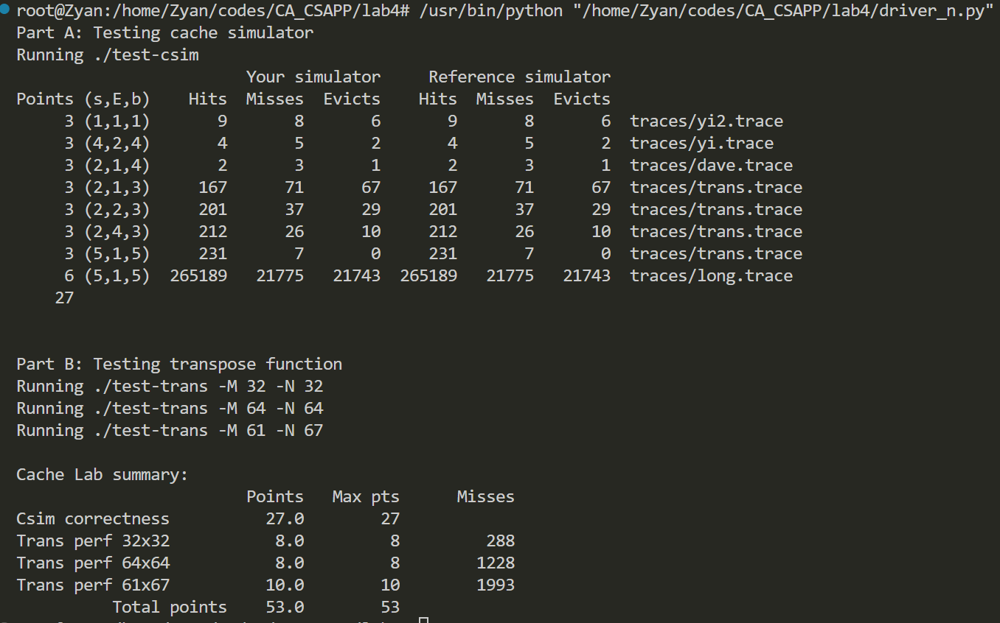

# CSAPP lab4 Cachelab

## Part I:  Cache Simulator

​	第一部分要write a cache stimulator from scratch，用 LRU 替换策略，并且和要和参考样例输出一模一样。模拟器从文件中读取命令，统计每组操作hit, miss, eviction并输出。

​	我选择用定义两个结构体来模拟缓存：`Cache` 里面有 S, E, B三个参数和一个二维的 `Line` 数组；`Line` 结构体就是 `cache line`, 由 `valid`, `tag` 和 `time` 组成，`time` 越大表示距离最近访问越久，以此来实现 LRU 策略。定义结构体`cache`，`hit`, `miss`, `eviction`计数器（初始化为0），verbose和字符串数组t（用来读文件的）为全局变量，方便调用。

​	在 `main` 函数里用 `getopt()` 函数（实验文档的建议）读取命令行参数，并传参s, E, b，调用 `inti(s, E, b)` 初始化，`getDo(s, E, b)` 对内存操作，最后 `printSummary(hit, miss, evict)` 输出。

​	定义 `init(int s, int E, int b)` 函数来初始化内存，这里的s和b都是位数，通过1的左移来得到组数和block。根据 S 和 E 对 `cache->line` 和 `cache->line[i]` malloc分配空间，并把每条 line 的 `valid` 和 `time` 置零，`tag` 置为 -1。

​	定义 `getDo(int s, int E, int b)` 来实现最关键的内存操作。从文件指令的格式为 `[space]operation address,size`，比较讨厌的是 `address`。`address` 的格式是 “tag s b”，用无符号数 `addr` 存储（保证是逻辑位移，方便操作），要取出 `tag` 和 S,  `tag` 用 `addr` 左移s+b即可，`addr` 右移 b 位后和 `(1 << s) - 1` 产生的掩码取 & 得到 S。然后根据 operation 来进行操作。L 和 S 都是对内存进行一次操作，而 M 是对内存进行两次操作，相当于一次 L 加一次 S。三个 operation 在这个模拟系统对 `cacheLine` 操作实际上是一样的，由函数`updateCache( )` 实现。

​	定义 `updateCache(int tag, int s)` 来实现对内存的具体操作。首先判断这一次操作是 hit 还是 miss（具体由函数 `hOrM()`实现），如果时miss，miss计数器自增，然后检查该组内存是否已满（具体由函数 `isFull()` 实现），如果满了就要进行 LRU 替换，evict 计数器自增，并找出LRU的那行（具体由函数 `findLRU( )` 实现），对这行进行更新操作（具体由函数 `updateLine()`实现）;如果是hit，hit计数器自增，直接进行行更新操作。如果是verbose模式下，miss, hit, evict的操作时输出对应文本即可。

​	定义函数 `hOrM(int s, int tag)` 来判断是 hit 还是 miss，遍历该组的每一行，如果有vaild是1且tag匹配的，hit，就返回具体的行数；若遍历结束，没有符合的，就返回-1 (miss)。
定义函数 `isFull(int s)` 来判断这组还有没有空位，是否进行替换，遍历每一行，有空位就返回行数，满了就返回-1。

​	定义函数 `findLRU (int s)`来找最新访问时间最久的组，遍历该组的 time，找到并返回最大值即可。

​	定义函数 `updateLine (int i, int tag, int s)`实现对cache line的操作，把valid置为1，tag更新为新的tag（在hit的情况下这两步操作虽然多余但没有影响），然后将这组内全部 cache line 的 time 全部加一，最后把更新过的那行cache line的time重置为0。

​	定义函数 `print_help()`，输出帮助内容。


## Part II: **Matrix Transpose**

​	第二部分是要用最少的miss来完成矩阵的转置，内存 *s* = 5, *E* = 1, *b* = 5，也就是说32组cache set，每组一条cache line 中 block是32位，也就是可以存放 8 个int。

​	先看 32x32 的矩阵，如果用传统一行转一列来做，B矩阵的列每次都是写入不命中，写完一列再返回写第二列原来的 cache 可能又没了，总的 miss 次数累积起来肯定零分了。根据实验文档，分块是个好的解决办法，由于一个cache line 可以存8个int操作一个数，剩下7个也进缓存了，为了充分利用好缓存，考虑分块为 8x8 的矩阵来转置。这样还有一个巧合就是除了对角线上的小矩阵，A在转置的过程中再缓存中和B不会发生冲突（画个图就能看出来了）。对于对角线上的分块， 由于A和B对角线块在缓存中的位置是一样的，一定会发生 conflict miss，而且过程中可能发生 thrash。实验文档里提示我们可以用本地变量，所以我们可以用8个本地变量暂存A分块矩阵的一行然后复制给B变成一列。不是对角线上的矩阵也可以这样操作。

​	到 64x64 的矩阵，四行就会填满 cache，就没有上面那种巧合了，但是整体的思路不变，还是分块，只是需要一些技巧来适当规避一些 miss。还是 8x8 分块，但是在复制的时候分成4个 4x4 小矩阵，先把A上面两个小矩阵复制过去，然后用四个本地变量保存右上的矩阵，然后把原来A左下的矩阵复制到B右上，再把本地变量里的值给B的左下，最后复制右下的小矩阵即可。

​	最后一个部分，得分给的相当宽松，可以选择 8x8 分块和 16x16 分块，两者都可以满分通过。


## Part III:  `csim` 的 flowchart

```
开始(main)
  └──> 解析命令行参数 (getopt)
        └──> 初始化缓存 (init函数)
        └──> 读取并处理操作命令 (getDo函数)
        └──> 打印结果总结 (printSummary)
        └──> 结束
init函数
  └──> 分配缓存结构内存
        └──> 计算得到S, E, B值
        └──> 为每个组分配内存
        └──> 初始化每个缓存行
        └──> 结束
getDo函数
  └──> 打开并读取文件
        └──> 循环读取操作命令 (fscanf)
              └──> 解析地址，提取tag和S
              └──> 根据操作类型更新缓存 (updateCache函数)
        └──> 循环结束
        └──> 关闭文件
        └──> 结束


updateCache函数
  └──> 检查是否命中缓存 (hOrM函数)
        └──> 如果未命中:
               └──> 更新未命中计数
               └──> 检查缓存是否已满 (isFull函数)
                        └──> 如果已满:
                            └──> 查找LRU行 (findLRU函数)
                            └──> 更新替换计数
                            └──> 更新缓存行 (updateLine函数)
        └──> 如果命中:
               └──> 更新命中计数
               └──> 更新缓存行 (updateLine函数)
        └──> 结束

```


### **自动评分结果**


