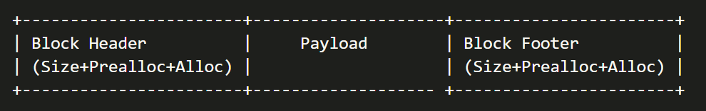
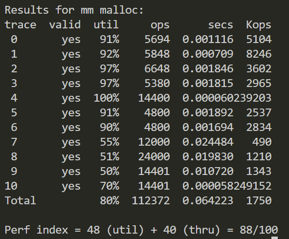

# CSAPP lab5 Malloclab

### 一、概述

​	这次实验是要实现动态内存分配的模拟程序。函数接口都已经给出 `mm_init(void)`, `*mm_malloc(size_t size)`, `mm_free(void *ptr)`, `*mm_realloc(void *ptr, size_t size)`。
​	我先按书上的给出的样例程序写了一遍，用隐式空闲链表和 First-fit 实现，样例是都过了，但是分数并不高。将First-fit 改成 Next-fit, 运行时间有缩短但是分数没啥变化。又将 `place` 函数改写了一下，不直接移动指针 `bp`，通过 `NEXT_BLKP(bp)` 计算得到地址来更新相邻后续空闲块的 header 和 footer，这次改动将分数提到了83分。后面优化 `realloc`，进行细化，不直接分配新块，如果新块的大小小于等于原来的块，直接原地分配，分数没啥变化。最后，继续细化 `realloc`，当新请求的块比原来的时候，看看是否可以与之后相邻的空闲块合并满足要求，满足不了再分配新的块，并把 header 中倒数第二位设置为前块是否分配的位，这一步提升到了88分。

### 二、数据结构

### 三、具体函数实现思路

**mm_init(void)**：调用 `mem_sbrk(4*WSIZE)` 创建一个包含对齐填充、序言块头部、序言块尾部和结尾块的初始空堆。这两个块都没有 payload，用来标识开头结尾。通过 PUT 函数将对应的值写入堆中相应位置，并把 `heap_listp` 和 `pre_listp` 都指向指向序言块。最后调用 `extend_heap` 函数提前扩展一个块。

**mm_malloc(size_t size)**：分配指定大小的内存块。将原始 size 转化为可以对齐的 size，调用 `find_fit` 函数来寻找合适的块的地址，如果找到合适的空闲块，调用 place 放置块；如果没有找到合适的块，调用 `extend_heap` 扩展堆，然后调用 `place` 函数放置新块。

**mm_free(void \*bp)**：释放指定的内存块。获取 size 和前序块信息，把该块的 header 和 footer 更新，然后调用`coalesce` 函数合并相邻空闲块（所有有关相邻块的操作都在 `coalesce` 中）。

**mm_realloc(void \*ptr, size_t size)**：重新分配内存块。判断 `ptr`，如果是空就相当于请求新的块，直接调用`mm_malloc(size)` 即可。size 如果是0，就相当于是 `mm_free`，直接调用 `mm_free(ptr)`。其他情况，获取要分配块的对齐大小，和原来旧块的大小，如果要分配块小于等于旧块，空间够，直接返回原地的指针就可；如果不够大就看看相邻后块是否可以合并，满足要分配块的大小。还不行的话，只能调用 `mm_malloc` 重新分贝一个大小，复制过去再释放内存。

**extend_heap(size_t words)**：扩展堆的具体实现。首先保证扩展的大小是符合对齐的，然后调用 `mem_sbrk` 扩展堆的大小，返回新的块指针，并初始新块的 header 和 footer。最后调用 `coalesce` 合并相邻的空闲块。

**coalesce(void \*bp)**：合并相邻的空闲块的具体实现。先获取获取前一块、后一块的分配状态和当前块的大小，然后分四种情况讨论：如果前后块都已分配，则不需要合并，直接返回当前块，调用 `set_next_prealloc(bp, 0)` 更新后一块表示前一块分配状态的位；如果前块已分配而后块是空闲块，则合并当前块和后块，将当前块的大小与后块的大小相加，更新合并后的块的头部和尾部信息；如果前块和前后都是空闲块同理。这样减少内存碎片，提高内存分配的效率。

**find_fit(size_t asize)**：`Next-fit` 查找合适的空闲块。从 `pre_listp` 开始查找第一个合适的空闲块，如果没有找到，则从 `heap_listp` 开始查找，直到找到合适的块或回到 `pre_listp`。

**place(void \*bp, size_t asize)**：放置请求的内存块。先使用 `GET_SIZE(HDRP(bp))` 从块头部提取块大小信息，先判断要不要分块，如果当前块的大小减去请求块的大小（asize）大于等于一个最小块大小（2 * DSIZE），则将当前块拆分为已分配块和剩余的空闲块，更新当前块的头部信息，将其标记为已分配，将下一块的头部和尾部信息标记为空闲，并设置其大小为 `size – asize`，并更新相邻后块的 `prealloc`；如果不拆分，直接放置，更新当前块的头部、尾部信息和相邻后块的 `prealloc`。最后把 `pre_listp` 更新为拆分的前块。

**set_next_prealloc(void\* bp, size_t prealloc)**：相邻后一块更新头部指示前块是否分配的位。

**mm_check(void)**：检查调试函数。分几遍遍历链表，确保块头和块尾的一致性，块是已经对齐，没有有连续的空闲块。

其他宏定义函数和书上的示例是几乎一样的，用来简化代码和提高可读性，比较简单，这里就不赘述了。

### 四、总结

​	这次实验的逻辑实际上并不难，主要难在实现和优化。调试的时候真的是指针满天飞，优化的时候也是牵一发动全身，而且还不一定有用，花费了好多时间。88分应该已经是隐式空闲链表的尽头了，更高的分要用Segregated Free Lists了。

#### 最终打分结果

